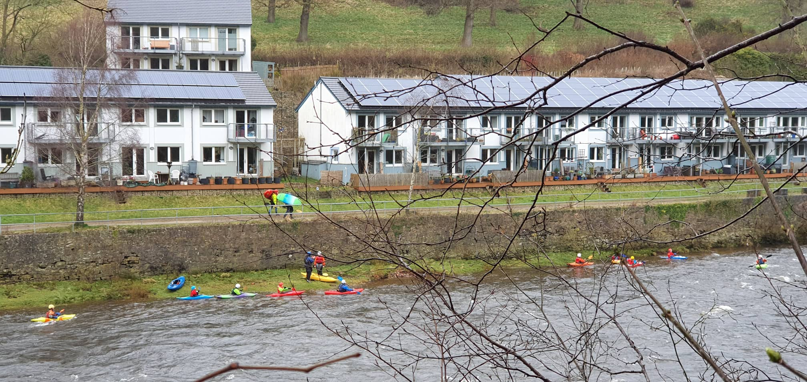

- [Strava](https://www.strava.com/activities/2885419436)

```{r setup, include=FALSE}
knitr::opts_chunk$set(echo = FALSE)
```

```{r, echo = FALSE}
  
```
Paddle report for Saturday 23rd Nov. Club paddlers on the water :- Dave, Rhi, Anna,Tom, Darren, Alan, Steve and Paul. Again this Friday, there was some rain and made Halton rapids the only real option for us all, on a low end of Low. Weather mild, overcast but the wind at river level,made it a bit parky. Tom helping Anna ease back into her stride and coaching Darren. The rest of us worked our way down from the top in pairs, making the most of what was there, reading the flow for the best lines and improving skills. Keep up the good work Rhi and Darren. We got 2 good runs down with only a few others on the water. Got off at about 1.00, just in tme for lunch and another opportunity to sample Alans fresh batch of Ginger nuts.
