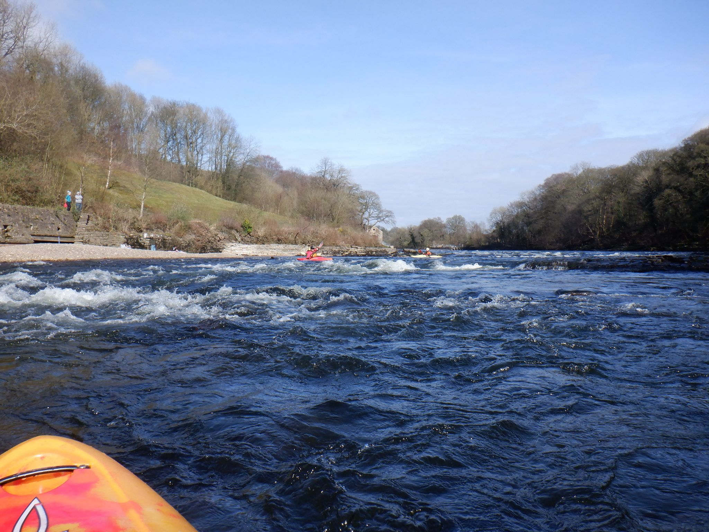

- [Strava](https://www.strava.com/activities/3002439116)

```{r setup, include=FALSE}
knitr::opts_chunk$set(echo = FALSE)
```

```{r, echo = FALSE}

```

Paddle Report for Sat 11th Jan There was a split trip again this week. I'll let the Leven crack troups enter their story. Rhi and Paul went to train at Halton rapids which was on high end of a Low. Despite the forecast for strong winds and rain we were lucky to get 2 runs down with only an occasional gust and a bit of drizzle at the end. Apart from a couple of lady paddlers from the Ribble club, we had the river to ourselves. Pushing our techniques on the usual manoevers and throwing in a little boofing practice as well. We worked till tired, which coincided with a downturn in the weather. Time for home, Tired and satisfied.
