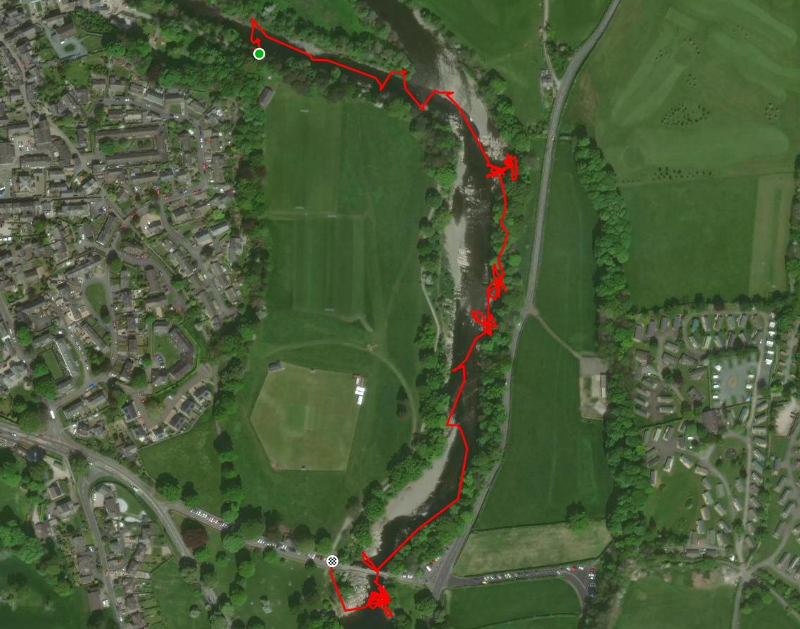

- The River Lune
- Playing at Kirkby Lonsdale
- [Strava](https://www.strava.com/activities/3102186901)

```{r setup, include=FALSE}
knitr::opts_chunk$set(echo = FALSE)
```

Strong winds and plenty of rain. Waters faster than I would choose! Swam after trying to follow Simon down a feature. Alec looked after me. Had another hairy moment later down the river, but stayed upright. Practiced ferry gliding under the bridge. Stopped for a pint at the Fenwick.

```{r, echo = FALSE}

```


