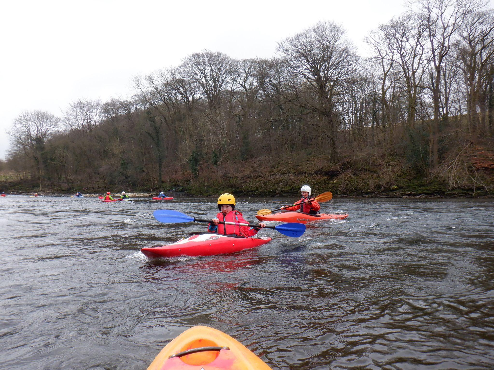

- [Strava](https://www.strava.com/activities/4145014898)

```{r setup, include=FALSE}
knitr::opts_chunk$set(echo = FALSE)
```

```{r, echo = FALSE}

```

A great session out on the Lune yesterday,Saturday 3rd October. 18 of us out paddling,it was actually quite warm and not as windy as expected and the worst of the rain came towards the end of the session. People arrived well spaced to get gear and it was mostly quickly loaded in Darren's van. Meant lots of cars headed for the old station car park but all managed to park,get their kit on,unload boats and get them down onto the big ramp in their 3 groups of 6. One group started on the flat water while the other 2 made their way onto the moving water below the weir. Had to keep well away from the weir as it was higher than the time before but plenty to play on. The slightly more experienced eventually looked after themselves,Amy and Eva joined Gibbi for their first taste of moving water and Eva proved to be AM-AZ-ING. Quick get-together at 12.15 and decision made to continue for another 45 mins or so Paul carried on with Kerry and Ruby who were finishing their beginners course (and it seems very much enjoyed their session),Colin and Anna took their group up to the bottom end of Halton Rapids (no fishermen). Some capsises but simply dealt with. Off the water and it went like clockwork to get back to the hut and put all gear away.
Keep an eye on here for details of the next event. Note there are probably 5 people already on the list for that. Also there was some confusion finding the latest Thurs ev post on the LDCC page and I hope we can get that sorted. Always scroll the page to find very latest and then only reply to that one and do even look for updates at breakfast the day of paddling!
