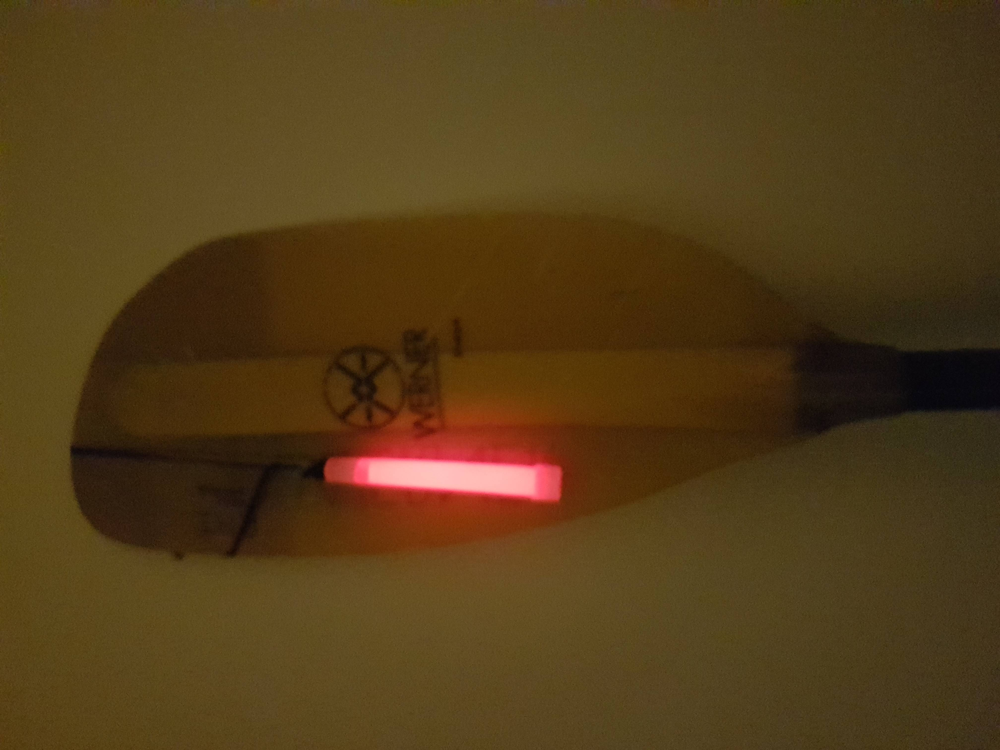

```{r setup, include=FALSE}
knitr::opts_chunk$set(echo = FALSE)
```
* Halton Rapids on 0.85m (Medium)
* Warm with wind picking up through the evening. Dark!
	
Dusk & night paddle. 13 paddlers in total. Ran the rapids once stopping at the islands to play. The others then did 2 more laps in the dark whilst I played at the islands. Paul brought glowsticks for everyone and hot cross buns. Lovely way to close the season.


```{r, echo = FALSE}

```

