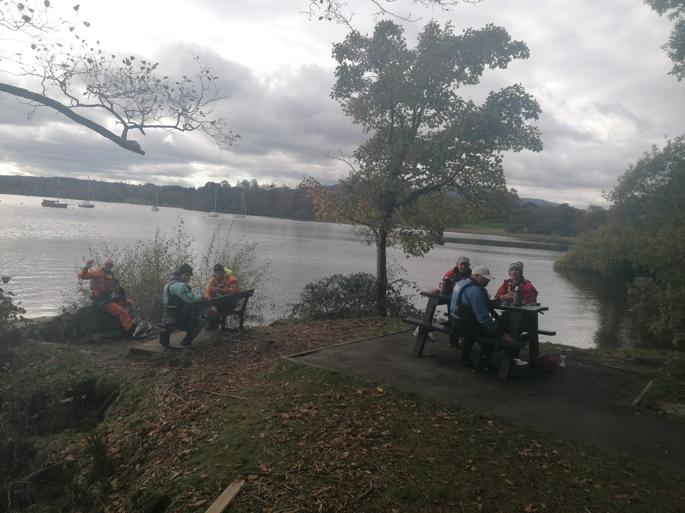

- Launch from Windermere Jetty Museum
- [Strava](https://www.strava.com/activities/6206299454)

14 paddlers met at the Windermere Jetty Museum for a coffee and cake. 
We split into two groups of seven, and had a chatty paddle up the east side of Windermere. After a lunch at Waterhead, we paddled across the top and down the west side, doing a quick lap of Bell Island before getting back in time to look around the museum.


```{r, echo = FALSE}

```


