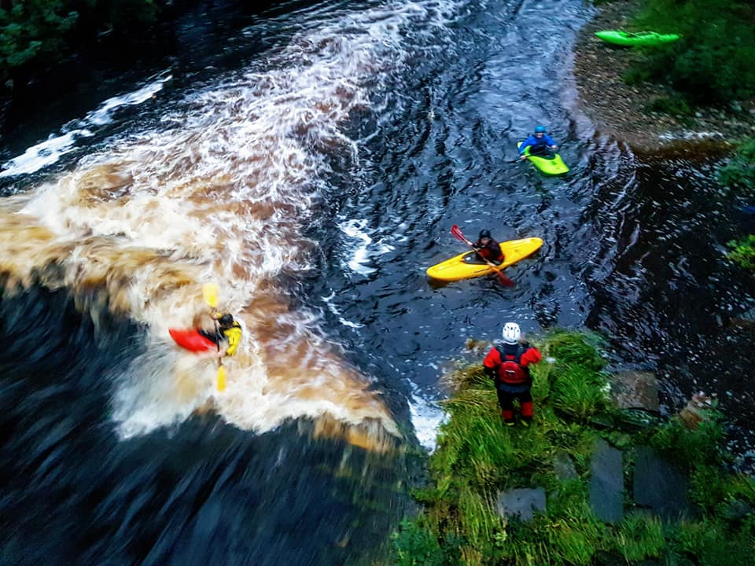

- River Wenning
- Punchbowl - Wennington

```{r setup, include=FALSE}
knitr::opts_chunk$set(echo = FALSE)
```

My first river trip. Lune was too high for the usual Thursday night paddling. Dave took me, Mandy, Steve, Alan and some of the ninja's to run the Wenning, whilst the others paddled the canal. It was quick, with lots of trees to avoid and small eddys to hit. Managed the wave at Wennington bridge before falling out and having a swim. 

```{r, echo = FALSE}

```
