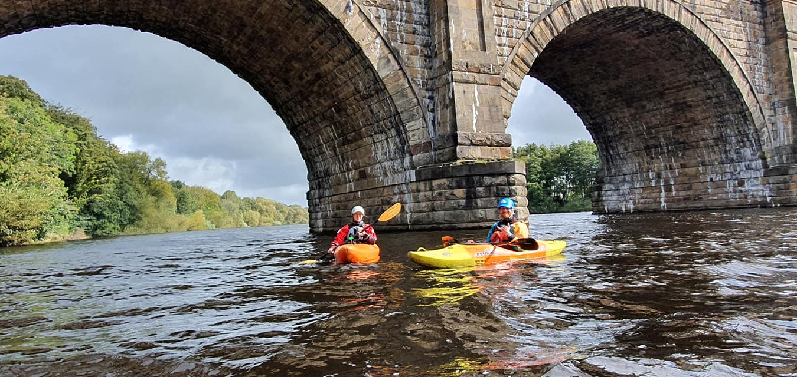

- [Strava](https://www.strava.com/activities/2708543174)

```{r setup, include=FALSE}
knitr::opts_chunk$set(echo = FALSE)
```

```{r, echo = FALSE}
  
```

The inaugural session of the winter paddling season was on this bright autumnal morning. We met at the hut at 9am sharp as per instructions given at the talk on Thursday evening. A select band including Rhian, Lucas, Darren, Steve, Joe, Rowan, Ruby and I, ably led by Paul. Some of us not knowing quite what to expect from the winter paddling season save from it’s better than staying in and watching Coronation street and that at some stage it’s going to get proper cold. But not today though, the weather was settled as the remanents of hurricane Dorian had moved away to the north to be replaced by high pressure and settled conditions. Dorain had not filled up the rivers much though. With the water levels on the high side of low Paul suggested our options were limited to coming down the Lune on the incoming tide or playing at Halton. We decided on the later and to warm we up we would paddle there from the hut up to Halton weir. We set off upstream towards Halton just before 10am pushed along by a pleasing tail wind. We hugged river left dodging the many scullers on the river that morning. At the weir Paul tasked us with ferry gliding across the moving water from one bank to the next, only to abandon this plan when we beached in the middle of the river, the river having inconsiderately deposited a load of stones and rocks right in our path over recent weeks. Plan B was to hop over the weir and to paddle a little further upstream to practice moving water skills at the bottom of Halton rapids. At the bottom of the rapids and watched over by a sinister looking stuffed badger we got to grips with ferry gliding across the flow, breaking in and out, spotting Eddys and holding position in the flow before moving a little further up the river to fine tune on faster moving water. Steve showed us the hidden dangers of surfing when he was unexpectedly turned over by a submerged rock only to roll up in impressive fashion. Joe and Rowan demonstrated what can be achieved in a year of paddling with their stylish play boating skills. Rhian, Lucas, Darren, Ruby and I grew in confidence as the day wore on. There was only one swimmer on the day and in my defence I went over on purpose to a) test my dry suit out and b) to show Ruby how to come out of your boat in moving water and not because c) I forgot to the mantra “paddle, paddle, paddle” at a crucial moment. We paddled home about 3 but not before Paul showed us how to hug some rocks. The pleasing tail wind was now a less than pleasing head wind but the scullers had gone home at least. The head wind made the trip back a challenge to tired muscles but the sunlight playing on the water lifted the spirits. What a great day! I can think of few better ways to spend a Saturday. Thanks to Paul for his tutelage and to Rhian, Darren, Rowan, Joe, Lucas, Steve and Ruby for great company. I learnt loads not least that the best place to play a didgeridoo is under the motorway bridge! Looking forward to the next trip.
