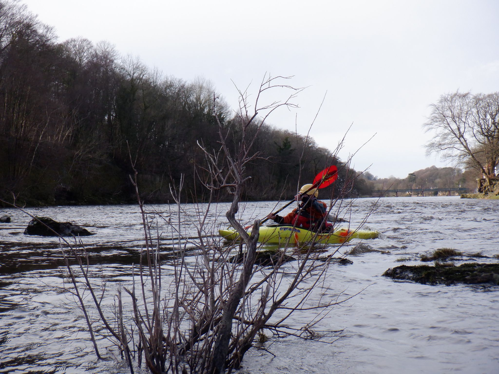

- [Strava](https://www.strava.com/activities/2730225522)

```{r setup, include=FALSE}
knitr::opts_chunk$set(echo = FALSE)
```

```{r, echo = FALSE}
  
```

So the 2nd saturday of white water season commenced at 9am sharp on 21/09/19, with no recent rainfall it was decided to head down to halton for abit of a play. Parking up at the old railway station, everyone geared up and braced themselves for a good 10min trek carrying the kayaks to the top of the wier along the cycle track, where we would begin our fun. Following David horns lead with help from Paul, Alec and Joe the beginners took to the water consisting of myself, Darren, kamikaze Gregg, Rhian, Kim, Mandy and steve (sorry if I've missed anyone). The first task was to see how far up we could paddle up a fast flowing section of water, Alec demonstrating how it was done comfortably. Everyone got stuck in with steve winning this particular challenge but everyone looked more confident with every attempt. We then headed down stream, occasionally getting stuck on the odd rock as the water levels were low. We practised picking a line through the Rapids and eddying out, everyone managing to do this well until on one section the water tipped my kayak. No problem though as I completed my first ever roll (ok I may of cheated and used an underwater rock to flip me back round but I'm claiming it). The water started to become a little more stronger which certainly got my adrenaline going along with my enjoyment. It was then on the next eddy where I think I was a little too eager to break out and ended up going for the only swim of the day, this is where the pool sessions came in handy and I calmly got to safety and reset myself for the next section. Further down we practiced ferry gliding/riding a wave. Something I'm certainly becoming more confident in doing after having a couple of opportunities to practise in the past. Darren was certainly enjoying his improvements and added confidence; every time returning with a gleeming smile. We then finished the day off by paddling down the middle of the lower wier and paddling across the strong flow a few times. It was a nice hot sunny day, enjoyed by all. Now time for a rest and a deserved beer or two, fingers cross for a week of rain.
