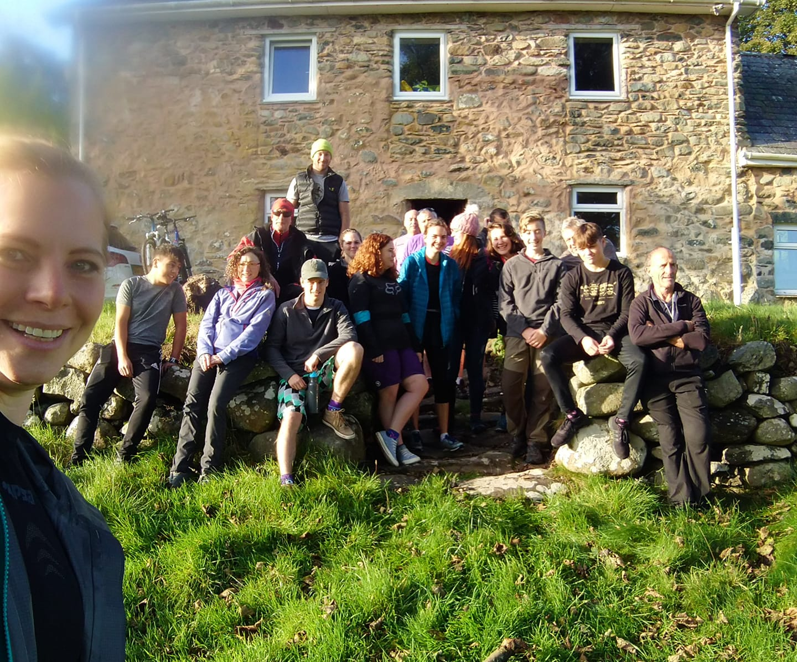

- River Conwy
- Betws to Llanrwst
- [Strava](https://www.strava.com/activities/2785976639)

```{r setup, include=FALSE}
knitr::opts_chunk$set(echo = FALSE)
```

Well you are probably going to see lots of pics of the excellent Club trip this last weekend. Could write an essay on it but best to be brief and to the point. Most people travelled down at various times during Friday but those who could get there by the afternoon took the opportunity to walk or mtn bike. By late evening fortunately most had managed the tricky navigation there and dug into Anna's pre-prepared chilli meal. After helpings of Paul's porridge groups broke off to paddle the Tryweryn; walk along the river via Swallow Falls; stroll in Betws and partake of food; the largest group, to MTN bike in the forest with a mix of itineraries to suit all levels, some hiring bikes/first timers/an e-bike and of course the experts. Back to BYG for a brew and shower and a meal in the pub in village.

```{r, echo = FALSE}

```

On Sunday, after cleaning the Centre, a small group on the Dee at Llangollen, but main group on a very pleasant paddle from near Betws to Llanrwst on the Conwy meeting up with locally residing Annette. Also, a couple of strollers. Then it was home. So, there was something for everyone to do . Fine accommodation, pretty good weather and great company. Thanks to Dave Horn for organising it all. Many have already expressed their gratitude elsewhere and told of their enjoyment of the weekend.


