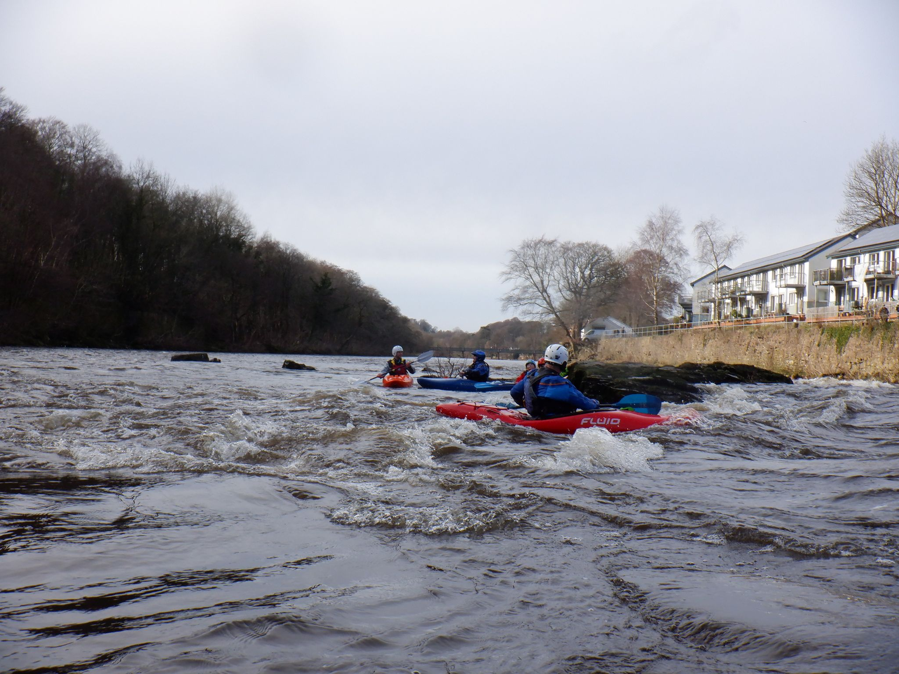

- [Strava](https://www.strava.com/activities/2853106435)

```{r setup, include=FALSE}
knitr::opts_chunk$set(echo = FALSE)
```

```{r, echo = FALSE}
  
```

Saturday,9th November with a 9am meet at the hut. Cold wind,cloudy and 4deg C.Gibbi,Alan,Steve,Rhi and Daniel were off to Halton Rapids and Thomas B came with us to give extra cover (thanks). Joe,Rowan and Thomas Ellison went off to do the Leven and then the Lower Kent but Thomas B left Halton during our lunch stop to join them for the Kent. A good 2 hour session from the top to start and lots of skills stuff. Small other group of kayakers. Surprised as a van,mini bus and car drove up to the hydro plant....turns out they were W Yorks Fire and Rescue and come to Halton for clean water to swim in. No clean rivers in Yorkshire? Well certainly not in some areas at the moment. Turns out they have had an arrangement with the hydro people for over a year and have the code for the gate!! Lunch taken in the warmth of the changing area with some lovely cake from Alan. Always worth paddling with him. Then a further 90 mins session. I think we were all pleasantly tired and ready to finish.
