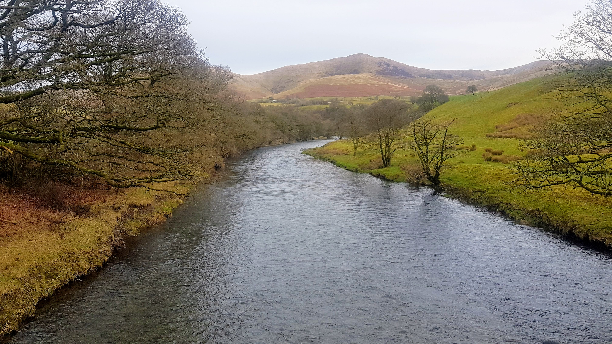

```{r setup, include=FALSE}
knitr::opts_chunk$set(echo = FALSE)
```

- River Lune
- Tebay to Lowgill
- [Strava](https://www.strava.com/activities/3022218370)

```{r, echo = FALSE}

```

Paddle report 18th January. It was a clear, crisp morning when we met at the hut. The group split up, with Paul, Darren, Alan, Steve and myself heading to the upper, upper Lune whilst the other group decided on the upper Lune. We got in below the grade 4 at Tebay (maybe next year... 😉) and warmed up with some ferry gliding. The river was on a low so the day was spent playing follow my leader and avoid the rock. I thought my river reading was improving a little until I planted myself on a rock and took a swim. Nature highlights included one lone black sheep and a pair of dippers playing. A little chilly but fulfilled we got out at Lowgill and stopped off to warm up at Longlands, Tewitfield. A lovely day to be out on the water, thanks all.

