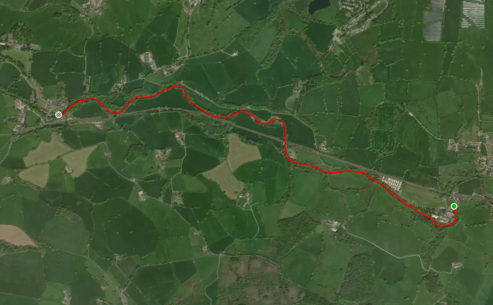

- River Wenning
- Punchbowl to Wennington
- [Strava](https://www.strava.com/activities/3142298323)

```{r setup, include=FALSE}
knitr::opts_chunk$set(echo = FALSE)
```

Saturday 29th Feb report. (Scary day for dedicated single blokes !) Storm Joge set arrive today aswell. At the hut we split into 2 groups but both doing the Wenning. Colin Howard , Rhi, Darren and Paul got on at the Punch Bowl after asking permission to use the pub cark park ( Landlord is a kayaker too). The other larger group of paddlers get on was a few more miles upstream, their report to follow i'm sure. The river was on a half way up a mid. No chance for a warm we set off into swift moving water. We worked as 2 pairs and got loads of breaking out/in practice. Still plenty of large enough eddies for the 4 of us . The higher level meant very few stones to impede our progress. It was good to see our 1st year paddlers getting stuck into consolidating their skills and gaining much more benefit than another Halton rapid session. Not wanting to spoil the day we got off before the Wennigton Bridge surf wave. The swift water meant we were off, dressed, shuttle done, quite quickly so we called in at the Tatham Bridge imbibing emporium . Highly recommended. Thanks for a great day gang.

```{r, echo = FALSE}

```

