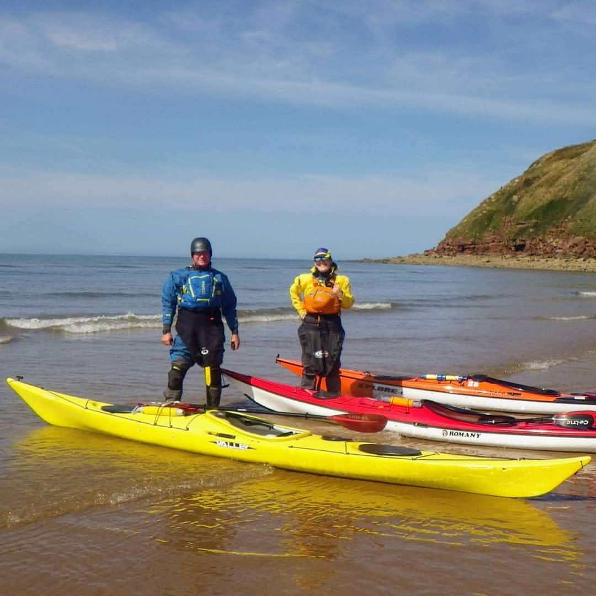

```{r setup, include=FALSE}
knitr::opts_chunk$set(echo = FALSE)
```

- [Strava](https://www.strava.com/activities/3890027186)

```{r, echo = FALSE}

```

Cumbrian Canoeists "Responsible Paddling" session led by Joe Stalker. Only myself and Rob Wilson so we had 1:2 coaching. First salty day for my new kayak! Joe did a gear review before getting on the water at 11:30am. HW was at 15:54 so we had a long carry down. Tried out the trolley for the first time with mixed success. Pushing at the front seemed to work best. We did some skills on the paddle to the North Head including turning, towing and forward paddling. We then turned around and paddled with a following sea towards Fleswick Bay. Before stopping for lunch we practiced eskimo and X rescues. After lunch we had a leisurely paddle alongside the South head, spotting lots of cormorants and porpoises. Before landing at St Bees, we did a couple more X rescues, including a real one when I lost my balance. My longest paddle so far (13.5k) I was quite tired but happy at the end of the session.


