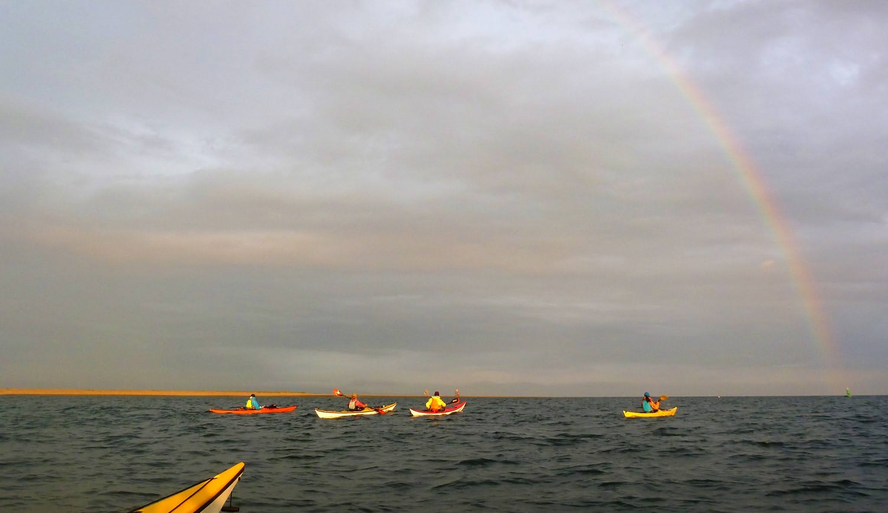

```{r setup, include=FALSE}
knitr::opts_chunk$set(echo = FALSE)
```

```{r, echo = FALSE}

```

Dusk paddle with UCC. Met Barry, Judith, Mark, Jemma and Will at Roe Island. On the water for 7:30. Paddled around Piel Island, up towards sheep island and then up along the shipping channel. Large rainbow and lovely sunset. Paddling with the flood up the shipping channel. On neaps. Got out at Ferry Pitching and did the shuttle. 
