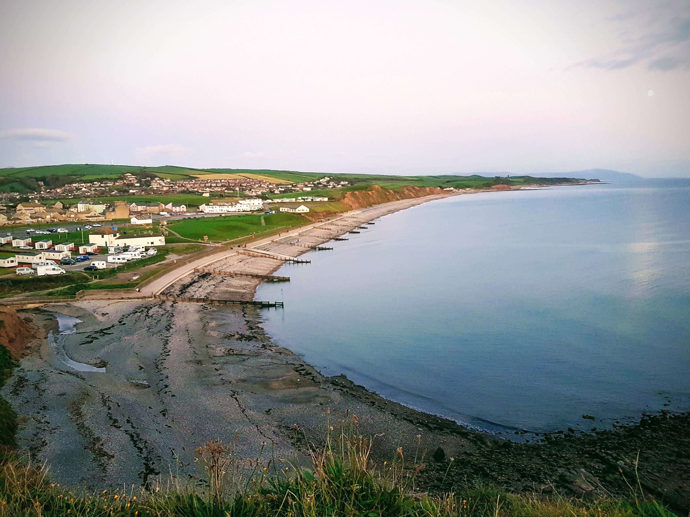

```{r setup, include=FALSE}
knitr::opts_chunk$set(echo = FALSE)
```

- [Strava Day 1](https://www.strava.com/activities/4116075670)
- [Strava Day 2](https://www.strava.com/activities/4121217732)

Force 5 winds, meant limited paddling choices. Met at St Bess, drove to Whitehaven, then back to St Bees again! 2 groups of six, led by Alan and Mark. We practised paddling out to South Head, into the winds, then looping back on ourselves. After a couple of loops, we turned south and paddled with a following sea. The paddle back up North into the wind was very hard. Eventually, we made it back to the slipway, and did a surf landing. Most of the group decided they had had enough for one day, and had a leisurely lunch. I had a lovely evening with Nic & Steve at their campervan.

```{r, echo = FALSE}

```

Thankfully, the wind was lighter on Sunday, and we headed North. We stopped at Fleswick Bay for a coffee & snack. I saw a seal (possibly the Fleswick bay seal). We started heading towards Whitehaven but some of the group were struggling with the speed, so we stopped for lunch on the rocks at Saltom Bay. We slowly and gently paddled back to St Bees slipway, and popped to Hartley's for tea.
