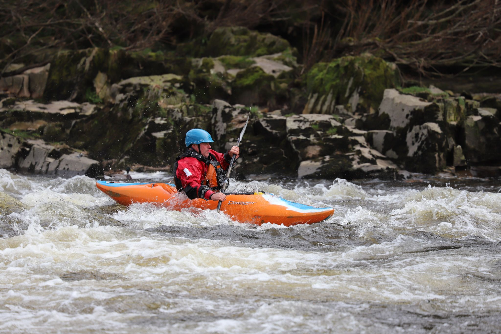

- [Strava](https://www.strava.com/activities/4236629860)

```{r setup, include=FALSE}
knitr::opts_chunk$set(echo = FALSE)
```

```{r, echo = FALSE}

```

Something for everyone today at Halton lower weir, Saturday 24th October. The forecast looked grim on paper but we seemed sheltered from the wind and except for one very heavy shower it wasn't too bad at all. There was the usual efficient getaway to Halton. Busy for parking again. 2 ladies made it know to me that they found it difficult to park to walk their dog. The University Rowing Club were also present and this made it congested on their slipway.Amazing how long their craft are. It was a good chance for a bit of PR with them firstly over the trailer in the car park and then over possible parking down the back of the station. The former will be moved when they can get a vehicle to do it and the latter parking will not be possible because access it via an area they will be using to prepare craft for launch. Also looked at other launch/egress points away from their slipway for future days.
4 groups then below the weir for a warm-up and skills session before one group headed off towards the rapids until virtually all were up there in and around the cyclepath side of the islands making the best use of what was available. Great to see how people have come on over the last 5 weeks and lots of paddling against the current has made them stronger. It had been decided to just have one longer session. Groups slowly made their way back downstream to exit river left on the weir baffle. We certainly got in a good 2 plus hours of paddling in and everyone seemed well satisfied.
We are likely to move the event to Sunday 1st November to make use of the whole river, as the fishing season ends, UNLESS the river level for that day is predicted to be way too high compared to the Saturday. We will approach the rapids from the lower weir. After that we will re-assess all our options.
As mentioned in a previous post competent members can go and paddle the rapids in their own time from 1st November and approach from the Halton Mills site. I will post the Covid guidelines in the next couple of days. Members who have not been out with us recently and would like coach support should post their request later in the week. Another group of paddlers who arrived at the rapids today were amazed when I told them we were all from one Club.....LDCC. Long may we continue this level of support!
Thanks to the lead figures today and of course Darren with van making kayak transport so much easier.
Gibbi
