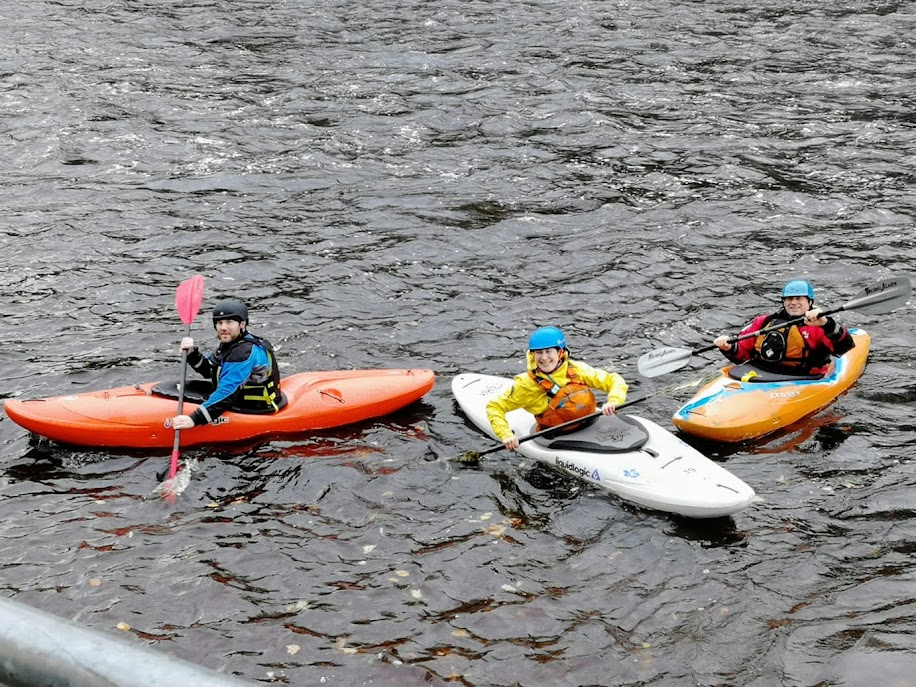

- 0.85m (Medium)
- Medium winds, chilly
- [Strava](https://www.strava.com/activities/4336227402)

```{r setup, include=FALSE}
knitr::opts_chunk$set(echo = FALSE)
```

```{r, echo = FALSE}

```

First paddle in lockdown. We met individually and got on at the top of the rapids. I was paddling with Colin, Ian, Darren and Dan. We played on the top weir for a while before making our way down. Ian led us on a ferry across some complex water. We spun out and eddied out a little lower than planned. Colin took a swim. We then tried to ferry out to the middle to run the two main groynes. This time I had a swim, getting out at the big eddy before the first groyne. Ian rescued me and later led me through the rapids. After lunch we had a second run. Colin and Ian had called it a day so this felt more like a peer paddle, choosing the lines ourselves. However, we had Rowan around to observe incase anything went wrong. Another great Saturday out - and I need to work on my edge!
