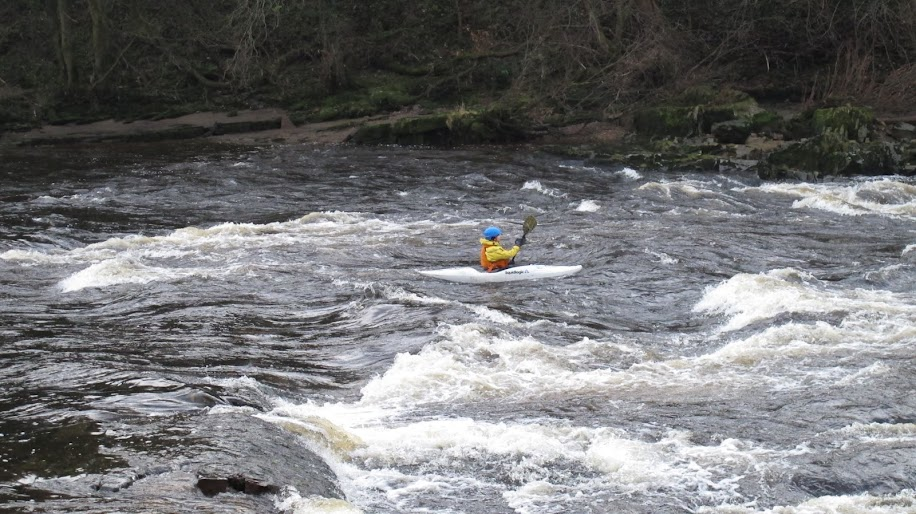

- 1.3 (Huge)
- Light rain
- [Strava](https://www.strava.com/activities/4369216614)

```{r setup, include=FALSE}
knitr::opts_chunk$set(echo = FALSE)
```

```{r, echo = FALSE}

```

1:1 session with Paul. Practised ferrying, surfing, bow rudders and draw strokes. Was feeling unconfident today and kept things easy. Need to remember to keep looking and high strong strokes. 
