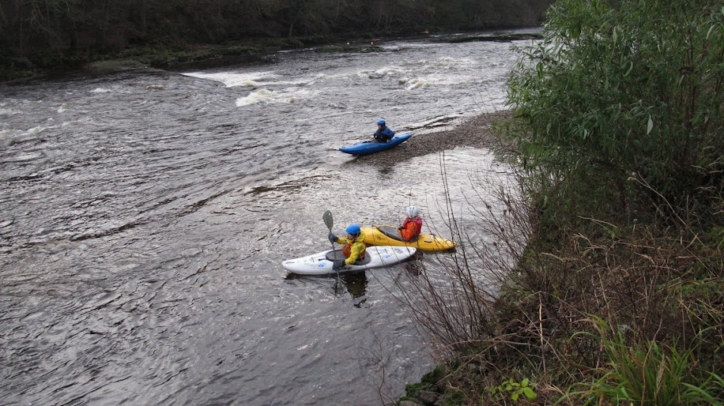

- 0.63 (Low)
- Cold and windy, light rain
- [Strava](https://www.strava.com/activities/4402936870)

```{r setup, include=FALSE}
knitr::opts_chunk$set(echo = FALSE)
```

```{r, echo = FALSE}

```

Much lower this week. Got on at the top with Darren, Adam, Ian, Colin and Gibbi. Paul & Paul were also out. Practised S turns and bow rudders at the top. Ian gave me some tips to improve my style - fewer paddle strokes and more body work. This seemed to work well. We picked our way down, much lower than last week so I was much more confident. After lunch we were joined by Alan, Steve and Phil. I paddled down with Gibbi who was keen to get off early. He said my paddling was improving and I felt that also this week. 
