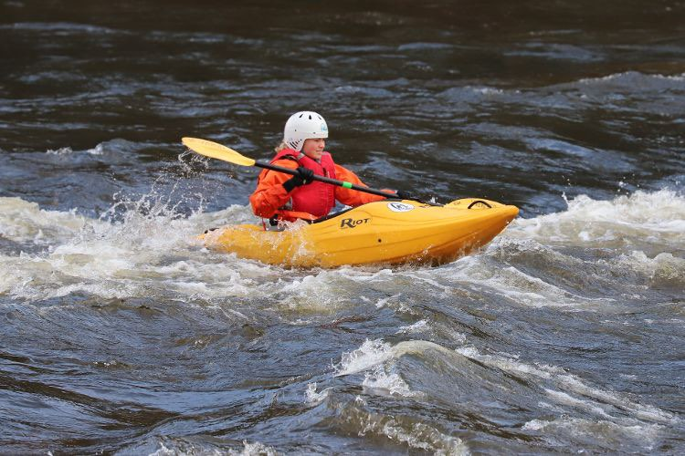

- 0.8m (Medium)
- Cold, crisp and clear
- [Strava](https://www.strava.com/activities/4437749511)

```{r setup, include=FALSE}
knitr::opts_chunk$set(echo = FALSE)
```

```{r, echo = FALSE}

```

The level was huge (1.3) on Saturday so we decided to paddle on Sunday instead. I went straight to the top with Richard, Colin, Ian and Alec. It was a busy day, with paddlers from LU, slalom paddlers and some open boats. We did 2 full runs and I did a third have run with Alis and Colin. We just did one long session before lunch. A good level for ferry gliding and breaking in. I pushed through some lumpy bits and stayed up-right. Was feeling a little tired today and missed a couple of my intended eddies. Nice to get out dry! 
