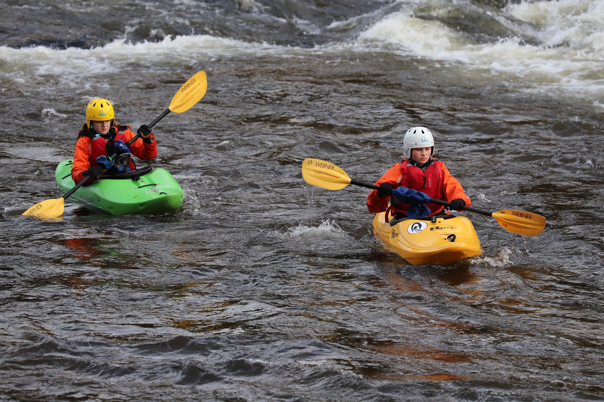

- 0.9m (Medium)
- Rainy at the start but brightening through the day
- [Strava](https://www.strava.com/activities/4468960403)

```{r setup, include=FALSE}
knitr::opts_chunk$set(echo = FALSE)
```

```{r, echo = FALSE}

```

Decided to paddle with the beginner group. I started off helping Molly doing some ferry gliding below the islands. We played on the islands until lunch break. After lunch we did two runs, one on river left and one on river right. Both Molly and Alis paddled really well and we got down some bouncy stuff. Gibbi must have had extra weetabix for breakfast because we were all knackered at the end of the session. Great day out. 
