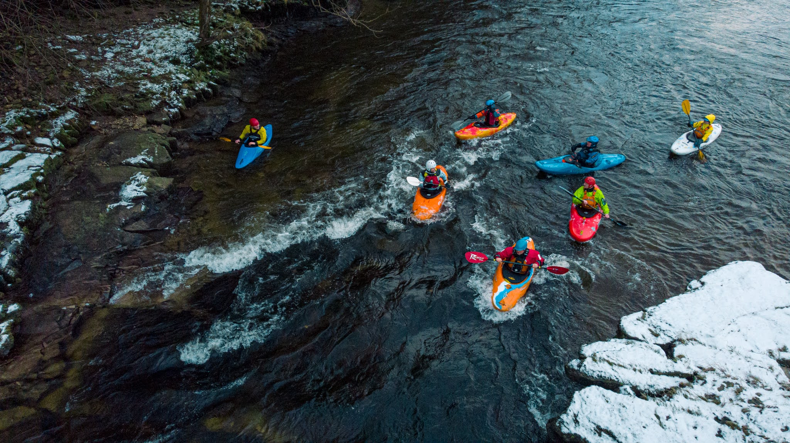

- 0.6 (Low)
- Very cold and snowing


```{r setup, include=FALSE}
knitr::opts_chunk$set(echo = FALSE)
```

```{r, echo = FALSE}

```

Started below the islands with Darren and Richard. Worked up a sweat trying to paddle up to the play wave. Joined Colin, Ian and Arne for a run. Had to stay in the main flow due to lots of rocks. Got cold and got off a little early. Might need more layers next week! 
