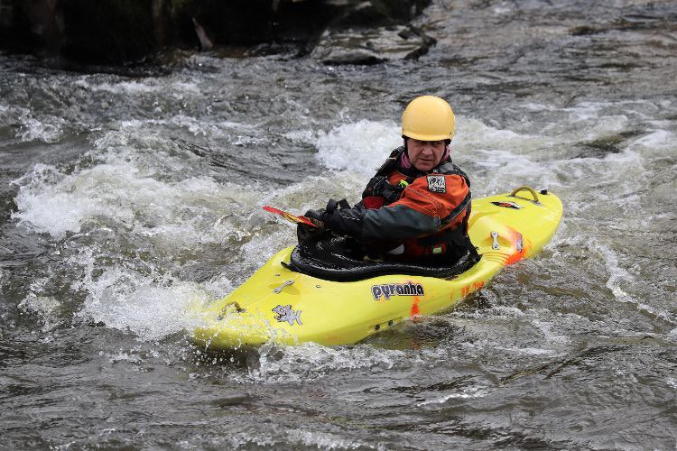

- 0.6 (Low)
- Chilly but bright. Cold easterly wind
- [Strava](https://www.strava.com/activities/4765418413)


```{r setup, include=FALSE}
knitr::opts_chunk$set(echo = FALSE)
```

```{r, echo = FALSE}

```

1:1 with Paul, warmed up at the top, practicing sweeps, edge and turning. Did one run, focussing on driving over the eddy line rather than turning on it. One swim when I went straight into a rock, a little tricky to get my feet out. Good play on the islands wave and a drive home.
