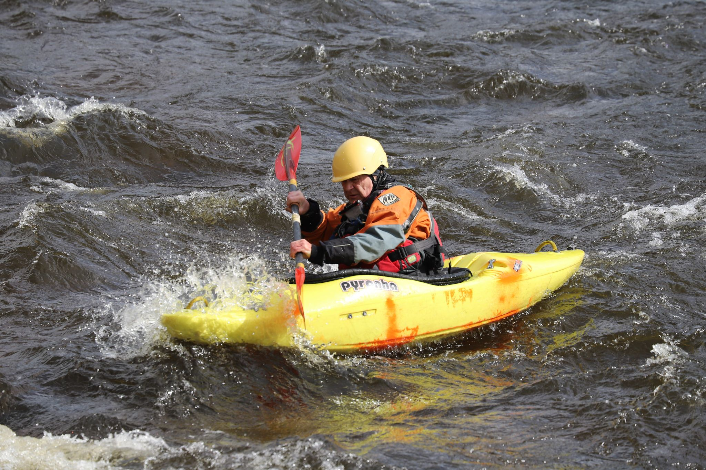

- 0.9m (Medium)
- Bright and clear. No wind.
- [Strava](https://www.strava.com/activities/4801843121)


```{r setup, include=FALSE}
knitr::opts_chunk$set(echo = FALSE)
```

```{r, echo = FALSE}

```

1:1 stayed at the islands for one session. Focussed on planting the paddles deep in the water and doing bow rudders.
