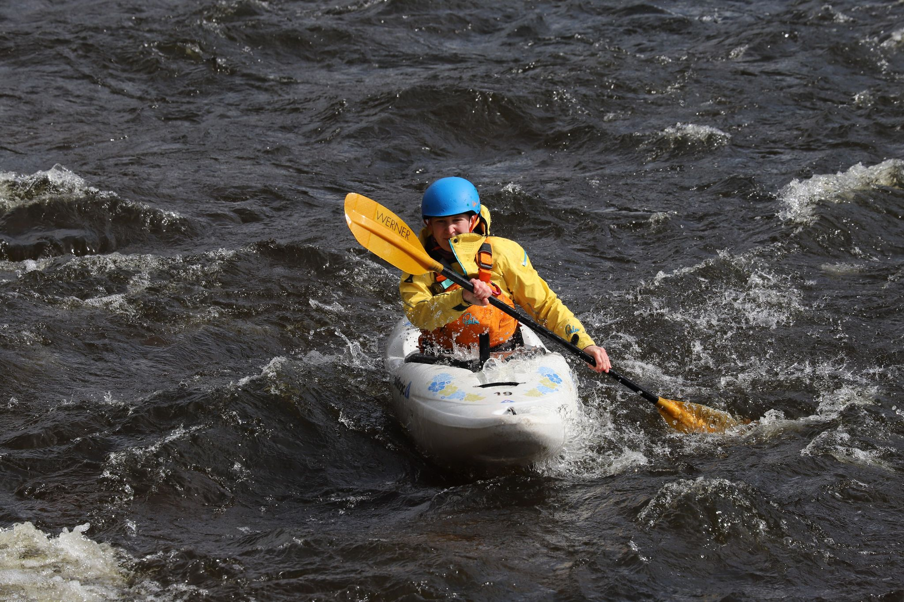

- 0.5m (Low)
- Bright and clear. No wind.
- [Strava](https://www.strava.com/activities/4907376118)


```{r setup, include=FALSE}
knitr::opts_chunk$set(echo = FALSE)
```

```{r, echo = FALSE}

```

Gibbi, Colin, Arne, Paul & Molly. Got on at the baffle, and played in the rapids. Then took Molly up to the top to do a run.
