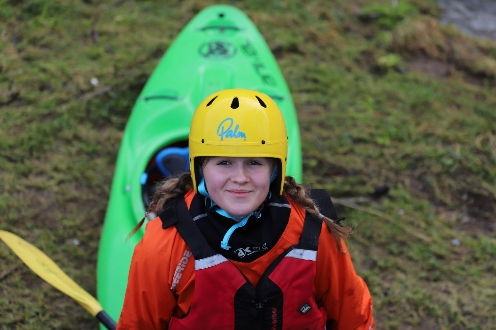

- 0.7m (Low)
- Rising winds
- [Strava](https://www.strava.com/activities/5019810663)


```{r setup, include=FALSE}
knitr::opts_chunk$set(echo = FALSE)
```

At the islands with Molly and Paul. Practising tapping rocks and getting into eddies properly.

Our final (daylight) session of the Halton season.

```{r, echo = FALSE}

```


