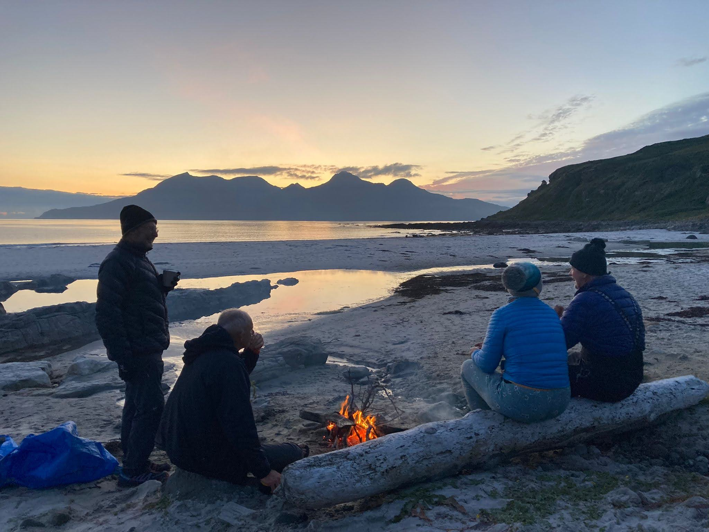

- [Strava Day 1](https://www.strava.com/activities/5799469718)
- [Strava Day 2](https://www.strava.com/activities/5803304005)
- [Strava Day 3](https://www.strava.com/activities/5808920797) and [evening](https://www.strava.com/activities/5808921438)
- [Strava Day 4](https://www.strava.com/activities/5823749295)
- [Strava Day 5](https://www.strava.com/activities/5823751063)
- [Strava Day 6](https://www.strava.com/activities/5823752497)

```{r, echo = FALSE}

```

This was a bit of an experiment for Cumbria Canoeists, combining the usual improver paddler series into one intensive week rather than spreading them out over the summer. 
Having a base at the bunkhouse on Muck was excellent - it gave us the opportunity to really get to know the coast of the island under different conditions and enjoy the hospitality of the local community.
One of the satisfying things about having a development week was seeing the improvements across the group in the week. Swell that felt lumpy to paddle on day one became a spot for practising rolls and rescues, rock hopping gaps which felt a tight squeeze seemed to get bigger through the week and anxieties of open water crossings transformed into a quiet confidence.
Personal highlights for me were our camping spot on the Isle of Eigg circumnavigation, watching a pair of Scottish eagles play in the wind and taking the local kids of Muck out for an evening paddle.
A massive thanks to Mike, Mac, Mike and Marie for their coaching and support and all the other paddlers for their lovely company!
Photos: https://photos.app.goo.gl/GfPnkH3AVtdowE5g6


