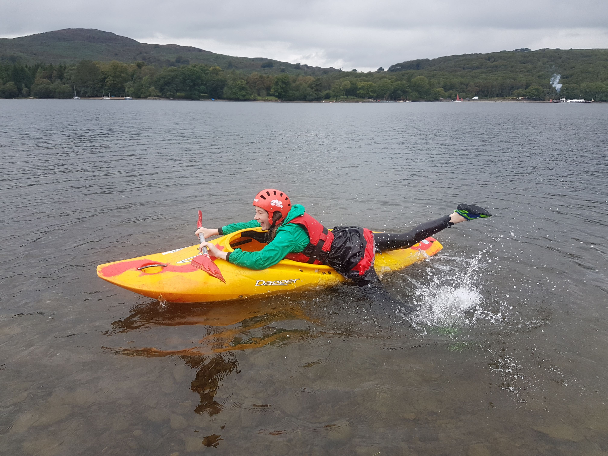

- [Strava](https://www.strava.com/activities/5979803946)

```{r, echo = FALSE}

```

An LDCC club trip on Coniston Water was attended by 17 paddlers. We eventually ended up parking on the east side on a LDNP field car park with the world's worst smelling toilets of all time!
Rain to start giving way to sunny, warm and calm conditions. Our paddle took us down the River Crake until blocked almost by trees, to a lunch stop on a beach west side and then finally to Peel Island before arriving back at the field.

Alec cycled to Coniston with his pack-raft

