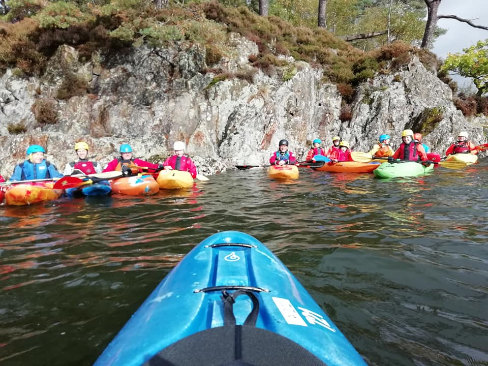

- [Strava](https://www.strava.com/activities/6057789239)
- Rothay 1.2 (medium) / Brathay 2m (high)

```{r setup, include=FALSE}
knitr::opts_chunk$set(echo = FALSE)
```

```{r, echo = FALSE}
  
```


Sunday 3rd October. Looking out the window this morning I wasn’t feeling too optimistic about today’s paddle. The Lune had doubled overnight, meaning Kirkby Lonsdale was out. And the prospect of paddling on Windermere in the drizzle and wind was not too appealing. Even the Halton Rapids demon Eva didn't want to get off the sofa this morning.
 
A crew of Gibbi, Paul, Alec, Rachael, Amy, Eva, Emma, Arne, Jenny, Darren, Simon and Dale assembled at the hut and we decided to head to Waterhead and try and sneak up some of the Rothay and Brathay with Dean meeting us there. Driving up to Ambleside, the sun did start to peak out from behind the clouds, and we were surprised to arrive and find Waterside Carpark partially underwater! Definitely lots of rain around.

We paddled from Waterhead pier, past the Brathay Hall boathouse to Brathay Bay, before turning back and up to the confluence of the Rothay and the Brathay. We spent some time near the cottage practising ferry gliding and eddy hopping. 

Alec took Darren, Arne and Simon to run the Clappersgate section, whilst the rest of us practised our ferry gliding and break ins. Eva was determined to paddle up the Brathay a little higher, and succeeded in powering up a fast moving section and a play wave, shortly followed by Dale (not to be out done!). The rest of us modestly decided to watch on from below. 

A great first taste of moving water for Dean, Emma and Jenny, and Simon’s first river paddle in a white water boat. Arne also got to try out his shiny new boat and paddle, and Paul was strutting his stuff in a new fluorescent orange dry suit! Great to be out and about again :) 
