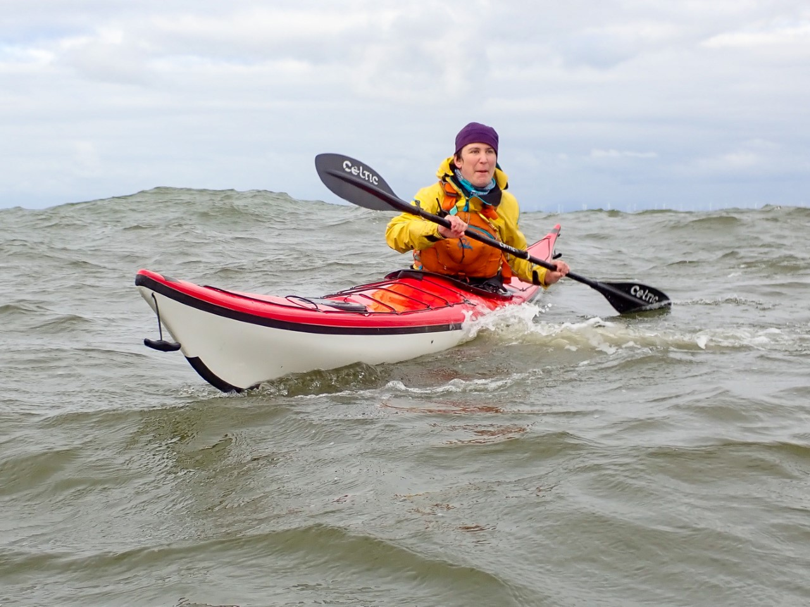

```{r setup, include=FALSE}
knitr::opts_chunk$set(echo = FALSE)
```

- [Strava](https://www.strava.com/activities/6107547422)
-	Force 4 westerly

A challenging start paddling out through the surf. Enjoyed exploring the estuary. 
Paddling north toward Maryport started to feel a little uncomfortable with the constant sideways swell. 
We decided to abandon the plan of paddling to Maryport, and head back for an early lunch. I felt a little nervous when paddling out in the swell, but actually when surfing back through it, it wasn't bad at all!

```{r, echo = FALSE}

```

>Wednesday 13th October – a grey windy day in Workington, not exactly the huarache sandals and baggies beach scene, but surf there was, so surfin we went. The original plan was for a group paddle from Workington to Maryport, though of the original signed-up group, only three of us made the venue (Mike Sunderland, Rhi Davies and me, John Soady). Might have been a bit of competition with a LCC beginner river white water event on the same day. Anyway, after a couple of km paddling along the coast with beam-on surf we agreed this wasn’t fun, so playing in it rather than fighting it seemed the thing to do. There was a westerly 4 pushing a 2ft swell, which kicked up to about 3ft of breaking surf over the sand bars where the Derwent meets the sea. It was fun for an hour or so until the arm muscles started to complain. Mike and Rhi then headed to Maryport for tea and I went on a fruitless petrol station hunt, eventually finding one 40 miles later at Ambleside.
