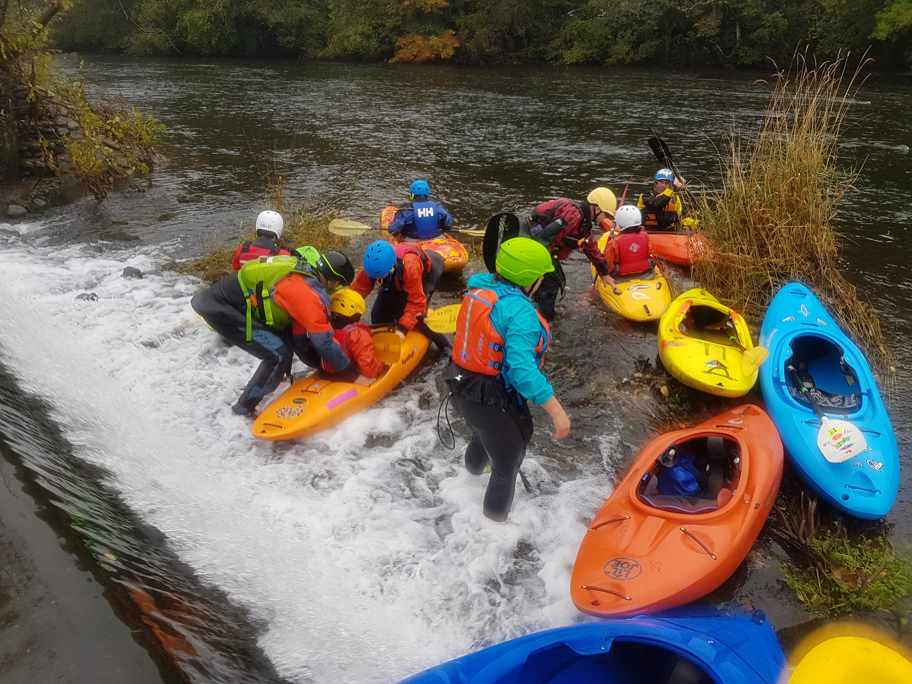

```{r setup, include=FALSE}
knitr::opts_chunk$set(echo = FALSE)
```

- [Strava](https://www.strava.com/activities/6126381482)
-	River Leven level at Newby Bridge 0.8m (Low)

My aim today was to support the club trip. I was aware that it was just me and Paul supporting a larger group today and I was. Paul took the front of the group and I was to bring up the rear. When we reached the weir, we had to decide if it was possible to take the group below the weir. We had a discussion with Mark W & Rich, and decided it was feasible to climb out of boats and carry down. Although it was a little bit of a faff, it gave us access to a venue with a little moving water.
Perhaps we should have communicated the plan with the group more clearly.

I was worried that I sometimes across as "strict teacher". E.g telling Michelle and Dale "you can't go there", "get in that eddy". I think that comes from me being fearful and not knowing "what is safe"

Keeping an eye on everyone at once was challenging. I found that sitting down river enabled me to keep most paddlers in frame, and be ready to pick anyone up if they dropped down-river. 

I spent some 1:1 time with Eva. She started off quite tired so I chatted with her and encouraged her to practice some surfing. Lending her my paddle helped with her tiredness. When we wanted a rest, we watched other paddlers try the leap frogging and reviewed their progress together. We also broke up the journey back looked for things on the journey (like the snail).

```{r, echo = FALSE}

```

> Today's paddle was (as always) AMAZING! We started off at Fell Foot and paddled down the River Leven until Newby Bridge. When we got there, we: surfed on a big wave, broke in and broke out and we played leep-frog going behind rocks. On the way back, I picked up a hitchhiker (a small snail) and I named him David Attenborough. 
We travelled back to the car, nobody worry, David was dropped off on a nice rock next to the lake. After, I practiced some rescues with Rhi's boat, don't panic she wasn't in it, it was empty, and it was really fun and it helped me alot
There was a nice mix of flat and moving water and it was good for the people not so confident on the white water...yeah... really smashing day! (Eva Kelly aged 11)
