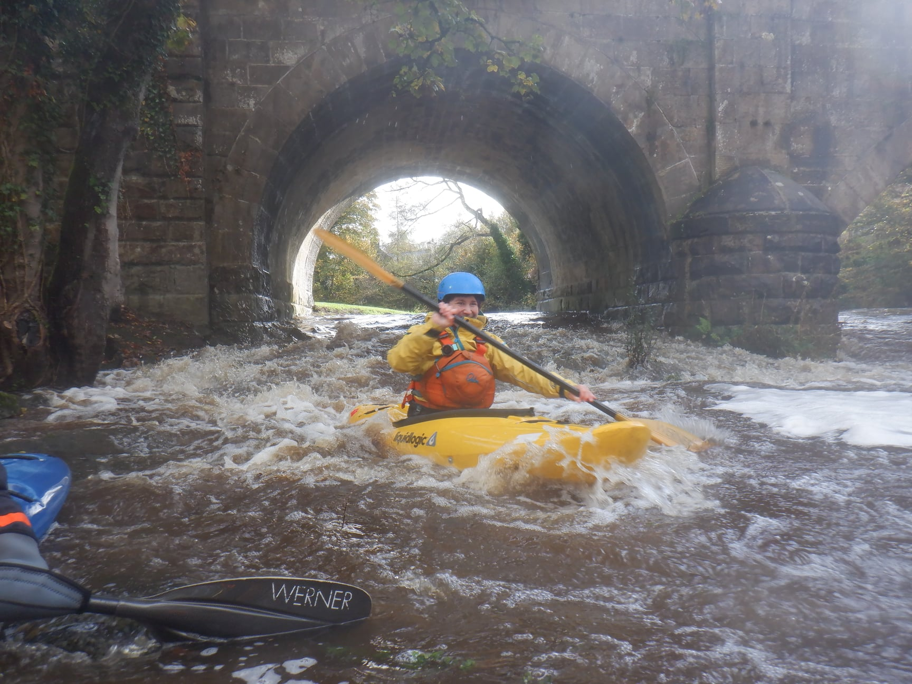

- River Wenning
- Punchbowl - Wennington
- [Strava](https://www.strava.com/activities/6186773577)

```{r setup, include=FALSE}
knitr::opts_chunk$set(echo = FALSE)
```

With flooding in the lakes, and lots of rivers on huge the choices were limited.
We decided on the Wenning which was due to be on a scrape (0.6m). However, it was actually more like the high end of a medium (0.9m - 1m). I was a little nervous, particularly about the get on which seems to be rushing through with few eddies. However, once I was on the water I felt pretty steady and confident.
We skipped the big wave at the bottom - sneaking through the right hand arch which for once had some water flowing through it. 
A good confidence-building day for my first day back on the river.

```{r, echo = FALSE}

```

> We started the fantastic day at 9am at the hut (after all it was a GOOD morning). It was decided that, given the river levels, we would go to run the Wenning. Gibbi, Paul B, Paul J, Mark W, Darren, Rhi, Rachael, Dave H, Alec, Steve-O and myself made our way up and put in at the Punch Bowl at Low Bentham. Cars were quickly shuttled down to the take-out at the bridge in Wennington (Wennington Wave). As the Wenning was moving fast it was a matter of getting on the water and straight into the current. We then made our way down  the bouncy river braking in and out of eddies enjoying the sun and enduring the downpours. After an absolutely fantastic paddle we reached the bridge in Wennington where a huge wave had formed since we had a look at it in the morning. Some paddled right through the huge wave to find a hole on the other side getting nice and wet, and Steve-O surfed and surfed (and he might still be surfing there, who knows?). After all this excitement Dave H, Alec, Mark, Rachael and Steve-O were stoked and decided to run the Ingleton Greta. The rest of us made our way back home in glorious weather - what a great day!

Arne Gerber
