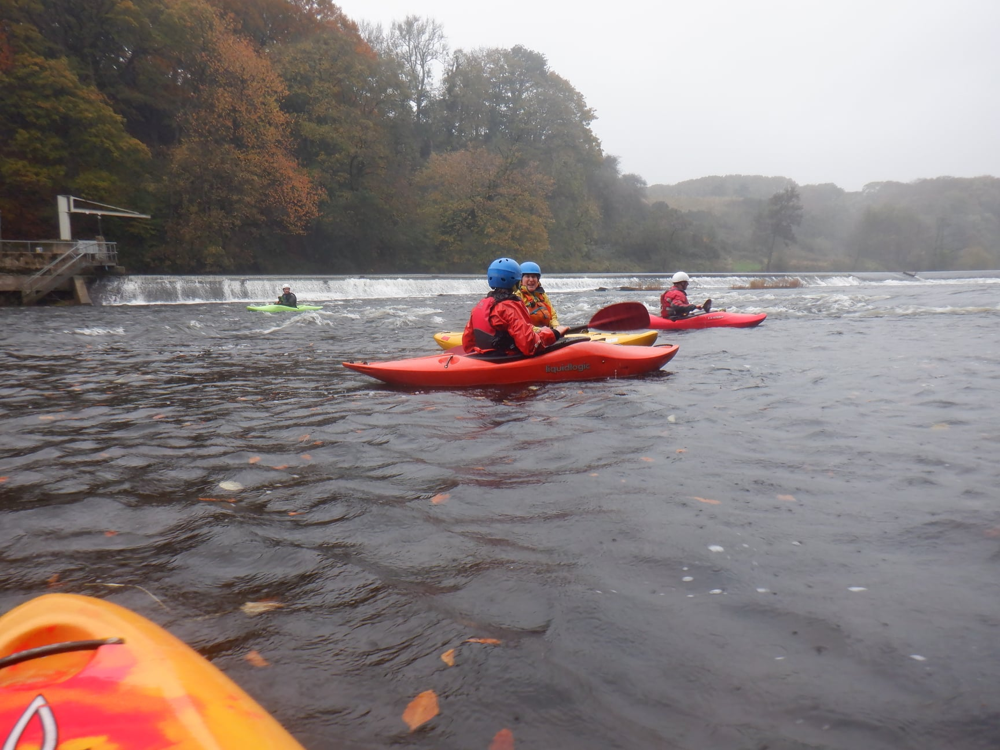

- [Saturday](https://www.strava.com/activities/6220271653)
- [Sunday](https://www.strava.com/activities/6225656977)

I went out both days. Saturday (0.7m) was a good confidence builder for me. Chose a line for Amy to follow through the rapids.
On Sunday level was a little more challenging (1m). I didn't feel I was paddling as well, maybe tiredness but it was sloppy.Not using sweep strokes, not paddling aggressively. Might be worth considering a slightly smaller boat at some point?

```{r, echo = FALSE}
  
```


> Well what a great weekend of paddling, 6/7th November on Halton rapids. The storms of Saturday put few people off and it was encouraging to see people coming on strongly. A very pleasant river level. How things changed overnight......the river was high Sunday morning so we delayed the start until 12. Still a big flow but wow, how well did people take to it. We are building up a promising group of paddlers.


