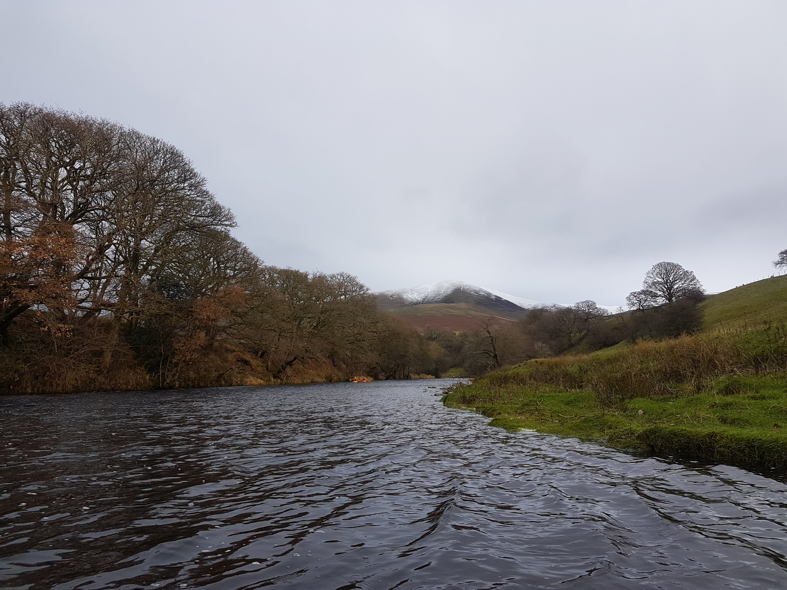

- [Strava](https://www.strava.com/activities/6346614339)

The upper upper Lune is one of my favourite paddles. A nice mix of small rapids, and long wider stretches to enjoy. There is a weird tranquillity of paddling nestled in the valley of Tebay. It's easy to forget that you're paddling alongside the M6.

I've paddled this twice before, and it was confidence building to come back and feel comfortable enough to play and feel a little independent from the coaches. Andrew has a couple of swims, and I mostly stayed out of the way, wanted to keep myself out of trouble and not make the situation any worst. One swim, he lost his paddle and it drifted near me, so I paddled over to pick it up. However, once I picked it up - I realised I had no way of paddling whilst carrying it. Instead of doing something sensible like throwing it into an eddy, or paddling with
two at once, I struggled holding both, whilst drifting, backwards, down the rapids. Not my most sensible moment. I did get stuck on a rock, but managed to pause and right myself before paddling into an eddy. Luckily Joe had run down the bank with me and was able to walk Andy's paddle back up stream to him. 

Definitely need some more rescue practice on moving water!

```{r, echo = FALSE}

```


>Aucht aye the noo! Just kidding.
PADDLE REPORT 5/12/21 - Upper (Upper) Lune
Small group today: Gibbi, Paul B, Paul J,  Dale, Darren, Joe, Steve-o, Rhi, Simon & me.
After dropping off all the boats and vehicles for the shuttle, most of us put in at the bottom of the rapids, but the more daring of the group decided to put in at the top and midway up the rapids. Conditions were cold but stayed dry all day (apart from the swimmer)..
Gibbi started off taking me under his wing for some skill work, then we moved further down the river until I decided it was a nice morning for a swim (or three) . Quickly rescued by the gang and all made sure I was fine each time.
Overall it was a very good day for it. Huge thanks to Gibbi, Paul & Simon for the coaching.
Andrew Irvine
