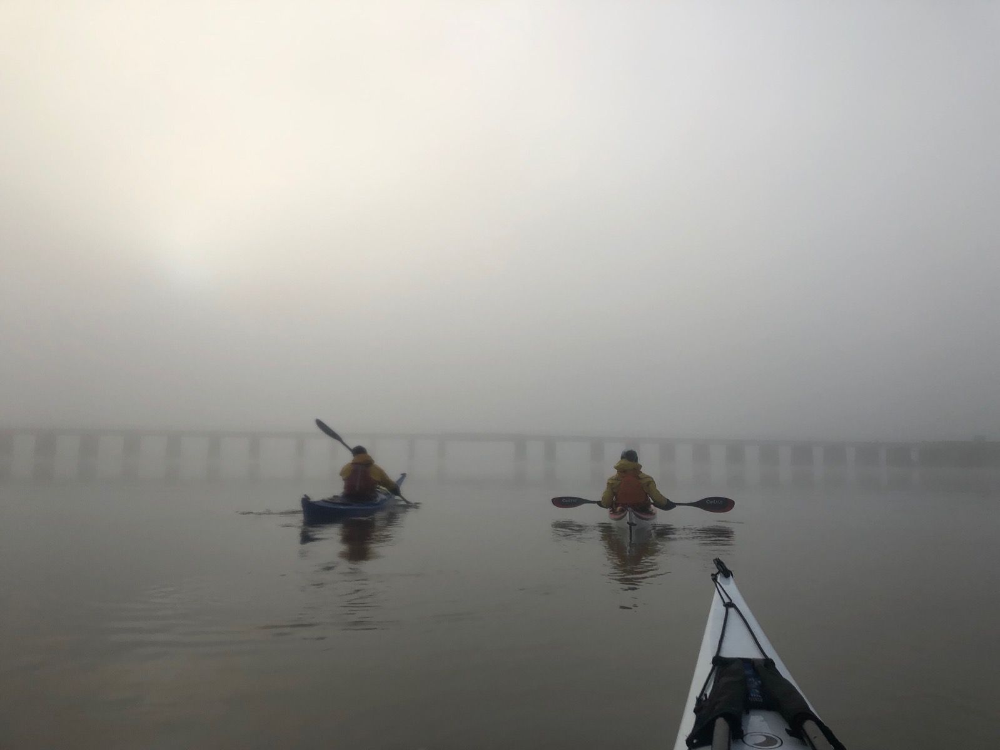

- [Strava](https://www.strava.com/activities/6402899596)
- HT Barrow 11:30am
- 12k
- Heavy fog, settled, cold

The plan was to paddled from Low Wood Bridge, Haverthwaite as far as we could get with the tide - perhaps Roa Island (30km). There were lots of options for get outs and we had Judith with a car happy to meet us wherever.

We'd planned to get on at the bridge at HT to ensure we had enough water. There was plenty coming down the river Leven and we had no problem navigating the bridge or the shallow river sections.

```{r, echo = FALSE}

```

The river quickly widened out and settled into a calm, lake-like state. The fog was still thick as we twisted and turned with the river. 
Soon the river became an estuary, and the grassy banks became sand banks. As the fog thickened, the temperature dropped. We could still hear the A590 and occasional trains, but could only fog. The section after Greenodd was tricky, with sand banks appearing from seemingly nowhere and forcing us to paddle around. The constant changing of direction left me feeling quite disorientated - especially as it was now quite hard to see where the sea finished and the grey sky began. At some points we could see no land at all, just shades of grey - sea merging into murky sky. It was hard enough just seeing each other! It's then that I realised in my rush I had left my whistle at home.


Eventually the train bridge came into sight. We took the wide gap, and cut to the right to catch the main flow. A short paddle later and Judith came into sight at Canal Foot, Ulverston. This was where Crayston was planning on leaving us. We were hungry for a late lunch, so we all got out for a break. The fog was still looking thick, and there was no chance of us making Roa Island today. After considering a couple of options, we decided to call it a day here, and vowed to return to finish the rest of the journey on another, hopefully warmer and sunnier day.
