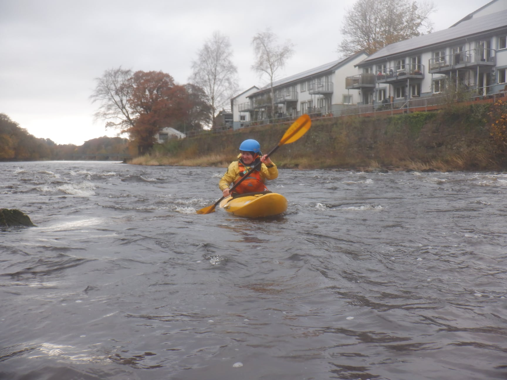

- https://www.strava.com/activities/6527485971

Two of our summer paddlers, Han and Eleanor came along for a first taste of moving water. Myself and Paul B spent the day with them helping them refresh their flat water skills and introducing them to ferry gliding and breaking into the current. 

Whilst Paul B & Eleanor worked on breaking in and out of the current, Han wanted to put it into practice. We played "follow my leader" with me following where he wanted to paddle. He came up with a challenge to cross the main flow to make an eddy high up stream. We never quite made it but had fun trying!

```{r, echo = FALSE}

```

> Saturday saw us on Halton rapids to give the youngsters a paddle after some of them missed out the previous weekend when rivers were high. a good level and a day that warmed up considerably. Dean, Adam and Sophie, Amy and Eva, Darren, Rhi, Paul B, Gibbi, Paul S with Josh and Thomas. Also Han and Eleanor who were out for their first moving water session and ably looked after by Rhi and Paul B on the lower section. They certainly took to it well! A 2 hour first run for most. All snacked and then some had a second run taking a more adventurous line down. Plenty of play on the surf wave all getting the hang of it.


