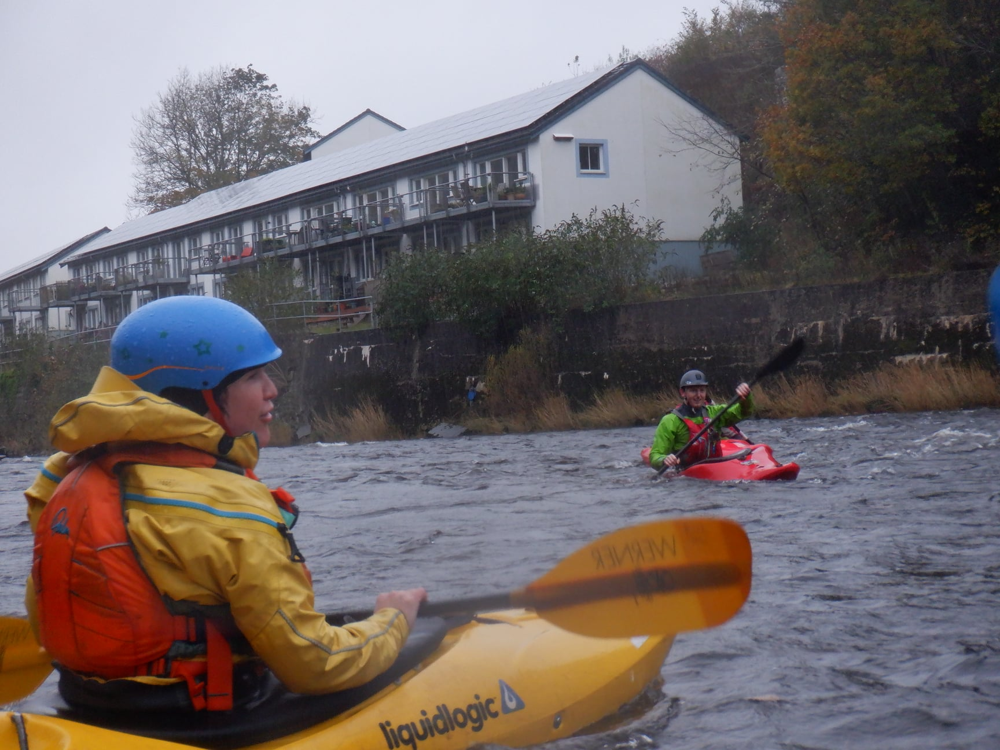

- [Strava](https://www.strava.com/activities/6569307688)
- 0.50m

A very low level today. We got on at the top. Sophie mentioned she was expecting more beginners and was hoping for an easier day. We paired up and I followed her around as she explored the top section. We inspected the first rapid, and then I set a line and she followed me down. I was a little nervous choosing a line for her, and being responsible for her but it worked really well. She wanted to skip the second set of rapids, so we scrambled over the baffle (and I fell on my bum). I then chased Dale's boat as he had a swim whilst playing in the middle of the final rapids. Unfortunately, he hit his head whilst trying to roll up and got a bump above his eyebrow. After lunch, Sophie and I stayed at the bottom, playing in the streams. We practised towing each other with a sling and ferry gliding with eyes closed. When Sophie was finally ready to get off the water, we drifted down to the steps and rescued a lost rubber duck.

```{r, echo = FALSE}

```

> Today's paddle was at Halton rapids which was running at a low level (0.50) with plenty of rocks above and below the water. The group consisted of myself, Paul B, Darren, Adam, Sophie, Dale and Rhi. 
We split into 2 groups and had 2 runs down. The 1st run we took our time, planning our route and stopping to play at various points.  Unfortunately at the end of the 1st run we had a swimmer who received a nasty shiner from a rock due to the low water levels but like a real trooper they got back in the boat for the 2nd run.
Upon returning to the hut we found Dean who had turned up a few weeks early for the planned pool session. Obviously extremely keen 🤣
Thanks again to all coaches for the expert tuition. Another great day out.
- Chris N

> Facebook report
